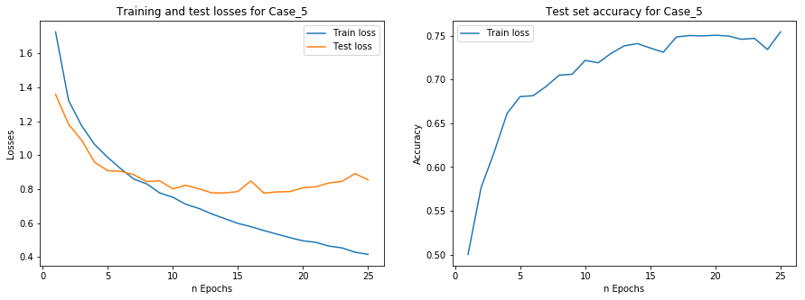
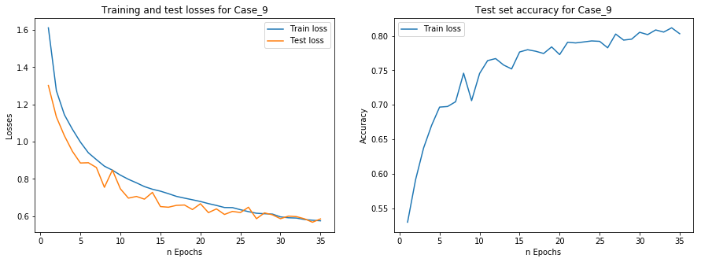

### CNN Model Comparisons for CIFAR-10

Case 1 - 63.24% - Basic Convolutional Neural Network (CNN)

 

Case 2 - 68.80% - Included additional Conv Nets

 

Case 3 - 71.57% - Added dropout to hidden Dense layers

 

Case 4 - 73.13% - Reduced complexity of model, and reduced learning rate

 

Case 5 - 75.47% - Increased additional Conv and Dense nets, removed dropout

 

Case 6 - 71.57% - Reduced model complexity, added dropout

 

Case 7 - 78.84% - Increase model complexity, added dropout

 

Case 8 - 76.81% - Attempted lower dropout rate

 

Case 9 - 80.34% - Implemented batch normalization

 

Case 10 - 80.05% - Changes made over Image Augmentation

 

Case 11 - 80.13% - Somewhat improved Image Augmentation

 

Case 12 - 81.72% - Tweaking model configuration and Image Augmentation

 

Case 13 - 86.46% - Drastically increased epochs, decreased learning rate, added dropout and additional batch normalization for Conv nets

 

